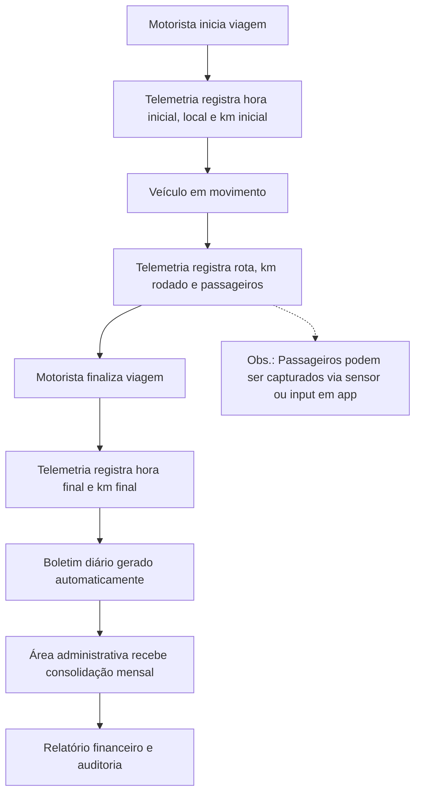

# Mapeamento de Processos – Atvos

Este documento apresenta o mapeamento dos processos e dados relacionados à locomoção de funcionários da Atvos, atualmente realizada por ônibus e mini-vans terceirizadas. O objetivo é demonstrar como o processo manual de marcação dos motoristas pode ser substituído por registros automáticos integrados à telemetria dos veículos.  

---

## Contexto do Processo

- **Problema atual:** registros manuais em boletins diários e mensais → suscetíveis a erros e inconsistências.  
- **Solução proposta:** captura automática via telemetria (GPS, odômetro, sensores e identificação do motorista).  
- **Benefício esperado:** confiabilidade, redução de retrabalho e integração entre operação e administração.  

---

## Processo de Ingestão de Dados

### Recebimento Automático via Telemetria
- Motorista inicia viagem → telemetria registra hora inicial, km inicial e local de saída (GPS).  
- Durante a viagem → telemetria captura rota, km rodado e passageiros (sensor/app).  
- Final da viagem → telemetria registra hora final e km final.  

### Validação e Qualidade
- Garantias automáticas: km final ≥ km inicial, rota válida, passageiros ≥ 0.  
- Redução de inconsistências manuais e lacunas nos registros.  

---

## Processo de Cálculo de Custos

### Km Variável
- Calculado automaticamente com base nos registros de odômetro e tipo de contrato (fixo ou por km).  

### Custos Fixos
- Tipo de veículo e valores previstos em contrato integrados ao sistema.  

### Consolidação
- Boletins diários geram consolidação mensal automática para área administrativa.  

---

## Processo de Geração de Relatórios

### Relatórios Diários (Boletim de Mediação)
- Captura automática de dados: hora, km, local, motorista logado, passageiros.  
- Resultado: boletim diário digital, sem preenchimento manual.  

### Relatórios Mensais
- Consolidação de totais, comparação entre planejamento e trajeto real (GPS), custos, rotas e áreas (agrícola/industrial).  
- Resultado: relatório mensal confiável e auditável.  

### Exportações
- Dashboards e relatórios financeiros gerados automaticamente para análise estratégica e auditoria.  

---

## Processo de Monitoramento

### Acompanhamento Operacional
- Rastreamento em tempo real de veículos, motoristas e passageiros.  

### Alertas e Notificações
- Alertas automáticos para inconsistências ou desvios de rota.  

### Escaladas
- Notificações para supervisores em casos de problemas operacionais ou divergências de registro.  

---

## Processo de Auditoria

### Trilha de Dados
- Histórico completo das viagens e alterações registradas.  

### Logs do Sistema
- Controle de acesso por perfil (Operação, Financeiro, Admin).  

### Controles
- Conformidade com governança, auditoria e proteção contra fraudes.  

---

## Fluxograma Geral

### Visão End-to-End

A visão end-to-end representa o **fluxo completo de dados e processos**, desde o início da viagem até a consolidação dos relatórios financeiros, permitindo identificar pontos críticos e oportunidades de automação.  

No contexto da Atvos:  
1. **Início da viagem:** o motorista inicia a rota, e a telemetria captura automaticamente hora inicial, localização e km inicial.  
2. **Durante a viagem:** o sistema registra trajeto percorrido, km rodado e, quando aplicável, quantidade de passageiros.  
3. **Término da viagem:** a telemetria registra hora final e km final, consolidando o boletim diário de forma automática.  
4. **Consolidação administrativa:** os dados diários são enviados automaticamente para o módulo administrativo, que calcula custos, compara com o contrato, e gera relatórios mensais confiáveis.  

Essa visão permite acompanhar todo o ciclo de ponta a ponta, garantindo **rastreabilidade, precisão e integração entre operação e área administrativa**.

---

### Pontos de Controle

Para garantir confiabilidade e integridade dos dados, alguns **pontos de controle** devem ser estabelecidos ao longo do processo:

| Etapa                       | Controle Proposto                                      | Objetivo |
|------------------------------|-------------------------------------------------------|----------|
| Coleta de dados do motorista | Verificação automática de inconsistências entre GPS e odômetro | Garantir que os dados capturados refletem a realidade da viagem |
| Registro diário              | Validação de campos obrigatórios (km, horário, veículo) | Reduzir erros ou lacunas nos boletins |
| Consolidação mensal          | Conferência de totais e alertas para desvios >10% | Evitar inconsistências nos relatórios financeiros |
| Auditoria                    | Histórico de alterações e logs de sistema | Rastreabilidade e compliance interno |
| Discrepâncias                | Notificação automática para gestor ou administrativo | Correção rápida de divergências |

---

### Integrações

O sistema proposto se integra com diferentes componentes para automatizar o fluxo de dados:

1. **Telemetria do veículo:** captura km, horários e localização em tempo real.  
2. **Sistema de gestão administrativa:** recebe os dados consolidados e calcula custos, totais acumulados e saldos.  
3. **Banco de dados central:** armazena registros diários e históricos de viagens para auditoria e geração de relatórios.  
4. **Interface do gestor/administrativo:** permite visualizar dados em dashboards, exportar relatórios e monitorar desvios em tempo real.  

Essas integrações permitem que o fluxo de informação seja **contínuo, confiável e auditável**, eliminando a necessidade de processos manuais e aumentando a eficiência operacional.

